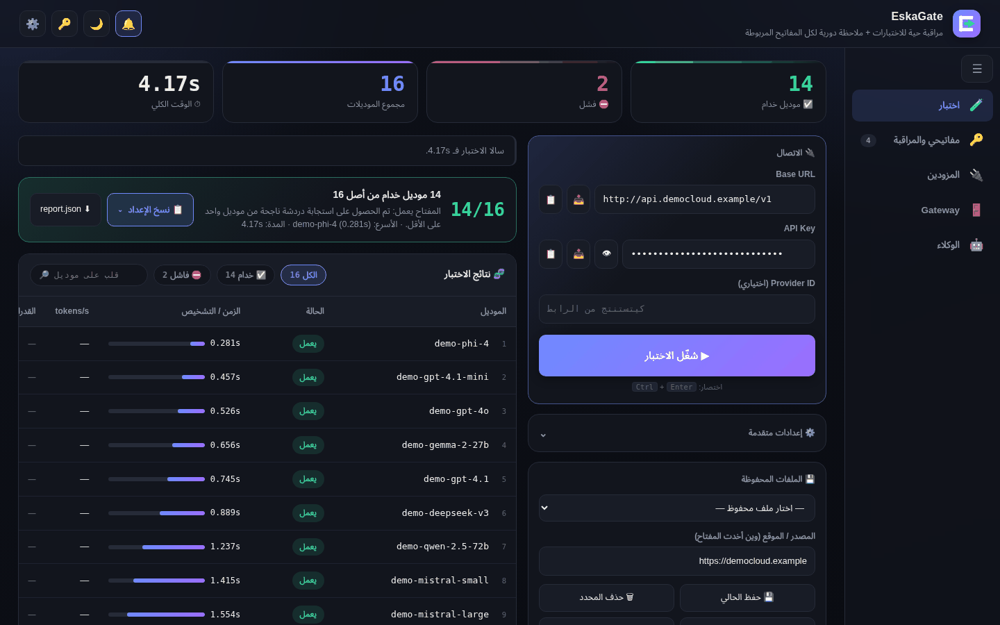
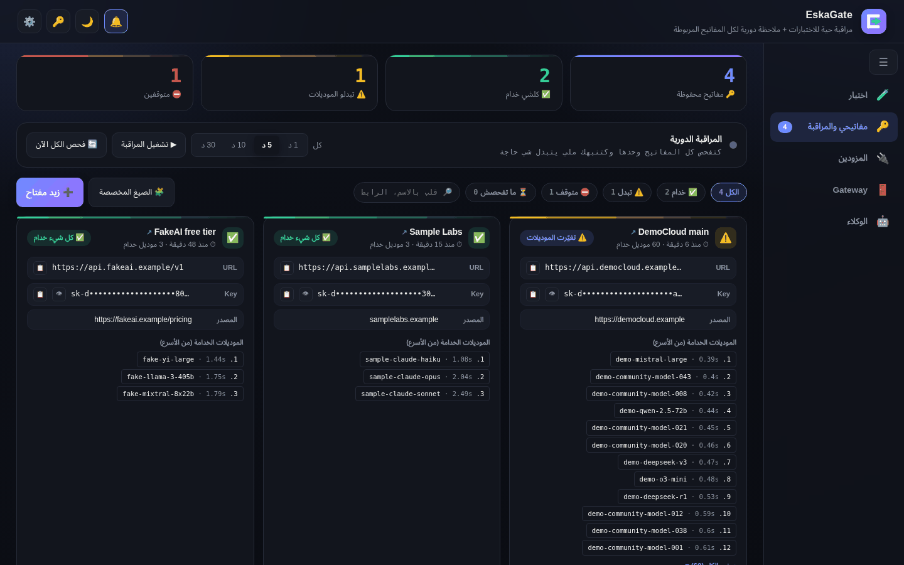
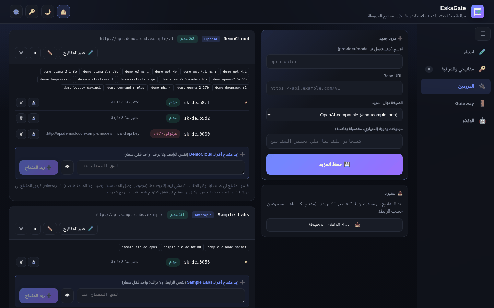
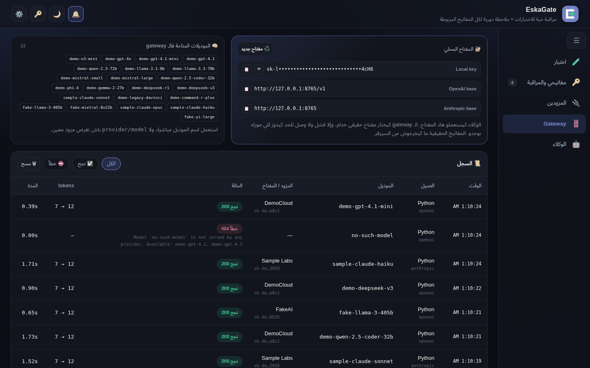
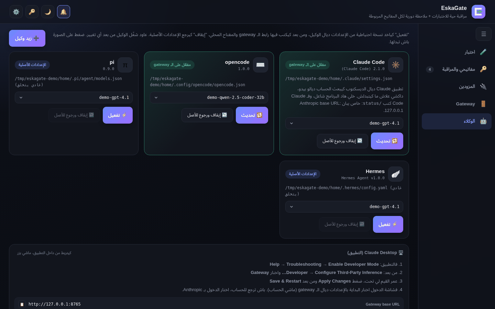

# EskaGate

A local web app for testing API keys and running a local AI gateway. It uses only the Python 3 standard library, so there is nothing to install beyond Python.

- **Test keys:** finds a key's models (`/models`, `/v1/models`), sends a short test prompt to each one and shows the results live. If a provider hides its model list, type the model names in the manual models field.
- **Monitor saved keys:** re-checks them on a timer and flags added or removed models.
- **Local AI gateway:** one local key (`sk-local-...`) in front of many real provider keys, with failover and OpenAI ↔ Anthropic translation.
  - OpenAI clients: `http://127.0.0.1:8000/v1`
  - Anthropic clients: `http://127.0.0.1:8000`
- **Coding agents:** switches Claude Code, opencode, pi, Hermes or a custom agent onto the gateway and restores their original config afterwards.
- **Phone access:** opens the whole site on your phone over the home Wi-Fi with a QR code (📱 button). Off by default.
- **Telegram alerts:** a message when a key or a provider goes down, an agent goes quiet, or things recover.

The UI is in Moroccan Darija. Keys and settings are stored in `~/.api-test-console/` (on Windows `%USERPROFILE%\.api-test-console\`), which only your user can read.

## Install in one line

> These commands download EskaGate from GitHub, so they work once this repository is public.

**Ubuntu** (in a terminal):

```bash
curl -fsSL https://raw.githubusercontent.com/Mohamedeskali/EskaGate/main/get.sh | bash
```

It needs `python3` (3.8 or newer) and `git`. If one is missing, it prints the `sudo apt install` command to run and stops; it never runs `sudo` itself. It installs to `~/EskaGate`, adds EskaGate to the apps menu and the desktop, and starts it.

**Windows** (in PowerShell):

```powershell
irm https://raw.githubusercontent.com/Mohamedeskali/EskaGate/main/get.ps1 | iex
```

If Python 3.8 or newer is missing, it installs Python 3.12 with `winget`, or explains how to install it from python.org. It installs to `%LOCALAPPDATA%\EskaGate` (no git needed), adds Start Menu and Desktop shortcuts, and starts EskaGate in its own window. Closing that window stops the app.

Run the same command again to update (see [Update](#update)). To remove EskaGate, see [Uninstall](#uninstall).

## Screenshots

The screenshots use made-up demo providers and keys.

**Test a key:** every model is tried live, with its status and response time.



| My keys and monitoring | Providers |
|---|---|
|  |  |
| **Gateway:** local key, endpoints and request log | **Agents:** switch coding agents onto the gateway |
|  |  |

## Manual install

Use these steps if you prefer not to run the one-line installers.

### Requirements

- **Python 3.8 or newer.** Only the standard library is used, so there is no `pip install`.
- Linux (for example Ubuntu) or Windows 10/11, and a web browser.
- `git`, only if you want to get the project with `git clone`.

### Install Python

- **Ubuntu:** Python 3 is usually already installed. Check with `python3 --version`. If it is missing, run `sudo apt install python3`.
- **Windows:** download the installer from [python.org/downloads/windows](https://www.python.org/downloads/windows/) and run it.

  > ⚠️ On the first installer screen, tick **"Add python.exe to PATH"** before clicking **Install Now**. Without it, `python` is not found and the app does not start.

  Then open a new terminal and check with `python --version`.

### Get the project

With git:

```bash
git clone https://github.com/Mohamedeskali/EskaGate.git
cd EskaGate
```

Or without git: on the GitHub page click **Code → Download ZIP**, then extract the ZIP. On Linux, if the scripts don't run after extracting, make them executable with `chmod +x *.sh`.

### Run on Linux

Run it in a terminal (stop with Ctrl+C):

```bash
./run-api-dashboard.sh          # port 8000
./run-api-dashboard.sh 8080     # another port
```

Or install it as an app, with an apps-menu entry and a desktop icon:

```bash
./install_eskali_api.sh               # run again if you move this folder
./eskali_api_launcher.sh stop         # or right-click the icon → stop
./install_eskali_api.sh --uninstall
```

The app runs in the background and logs to `~/.api-test-console/eskali_api.log`.

### Run on Windows

1. Install Python as described above, with "Add python.exe to PATH" ticked.
2. Double-click `Run API Dashboard.bat`. The browser opens at `http://127.0.0.1:8000`. Keep the window open, because closing it stops the server.
3. Optional: double-click `create_shortcut.vbs` to add a desktop shortcut.

To use a different port, change `8000` in `Run API Dashboard.bat`.

## Open it on your phone

1. Press **📱** in the top bar. EskaGate starts listening on your PC's home-network address and shows a QR code.
2. Scan the QR code with the phone camera. The phone must be on the same Wi-Fi as the PC, not a guest network.
3. The phone opens the full site: test, keys, providers, gateway and agents.

How it stays private:

- By default EskaGate listens on `127.0.0.1` only. The home-network address is opened only when you press 📱, and it closes when EskaGate restarts.
- The link in the QR code holds a random secret. The phone keeps it in a cookie after the first visit, so the secret leaves the address bar. Any request without it gets `401`.
- Only devices with a private (home network) address are accepted. On the PC, `127.0.0.1` keeps working without the secret.
- **⛔ Stop phone access** in the same window closes the network address and changes the secret, so old links and old cookies stop working.

If the phone can't open the page and Ubuntu's firewall is on, allow the port for your home network (the window shows the exact command), for example:

```bash
sudo ufw allow from 192.168.0.0/16 to any port 8000 proto tcp
```

## Telegram alerts

The gateway can send you a short Telegram message, wherever you are, when:

- a key fails (out of credit, rejected, rate limit, provider down), and which key or provider it switched to;
- all keys of a provider are down;
- an agent was sending requests and then sent none for N minutes (default 10, `0` turns it off);
- things recover ("✅ back to normal").

- **Daily summary:** once a day (default 09:00, PC time), one message per agent that had traffic: requests, tokens, and how many times its key was switched since the last summary. If the PC was off at that time, it is sent when EskaGate starts later that day.
- **Early warning:** when a key's remaining requests or tokens drop under 10% of its limit, one warning per key per day, before it actually fails.

The same cause for the same provider is sent at most once every 5 minutes. Messages contain the provider name, the agent name and a masked key such as `sk-ab…wxyz`. They never contain prompts, answers or full keys.

To set it up:

1. In Telegram, open **@BotFather**, send `/newbot` and copy the bot token it gives you.
2. Open your new bot and send it `/start`.
3. In EskaGate, open **⚙️ Settings**, paste the token under **Telegram alerts** and press **🔎 جيبو** to fill in your chat ID.
4. Press **💾 حفظ** (save), then **📨 رسالة تجريبية** (test message).

**Control from Telegram.** Send these to your bot. Only the saved chat ID is answered; other chats are ignored.

- `/status`: one line per provider with the active key (★), how many keys work or are cooling down, and the reported quota.
- `/switch <provider>`: makes the next available key (not cooling down, not rejected) the active ★ key of that provider, and replies with the result.

**Remaining quota.** After each request the gateway reads the provider's rate-limit headers (`x-ratelimit-remaining-requests`, `x-ratelimit-remaining-tokens`, `anthropic-ratelimit-*`, `ratelimit-*` and similar). The numbers show on each key in the Providers tab and in the alerts. A provider that never sends them shows "ما مصرحش" (not reported). Nothing is guessed and no extra endpoint is called.

**Alert history.** Every alert sent is logged in `~/.api-test-console/alert-history.jsonl` (time, provider, type, message). The Gateway tab shows it under **🔔 سجل التنبيهات**, filterable by provider or agent, type and period, with counts per provider and type (for example how many times a provider ran out of credit this month).

The token and chat ID are saved in `~/.api-test-console/telegram.json`, readable only by your user. The page shows them masked. Leave a field empty to keep the saved value. The toggle turns alerts off without deleting the settings.

## Update

Run the one-line install command again. It updates EskaGate to the latest version and keeps your keys and settings:

- **Ubuntu:** updates `~/EskaGate` with `git pull` and restarts EskaGate if it was running from there.
- **Windows:** replaces the files in `%LOCALAPPDATA%\EskaGate` and restarts EskaGate if it was running from there.

With a manual install, run `git pull` in the project folder, or download the ZIP again and replace the files. Then restart EskaGate.

## Uninstall

**Ubuntu:**

```bash
curl -fsSL https://raw.githubusercontent.com/Mohamedeskali/EskaGate/main/get.sh | bash -s -- --uninstall
```

**Windows** (in PowerShell):

```powershell
& ([scriptblock]::Create((irm https://raw.githubusercontent.com/Mohamedeskali/EskaGate/main/get.ps1))) -Uninstall
```

Both commands stop EskaGate, remove its shortcuts (apps menu and desktop, or Start Menu and Desktop) and delete the app folder (`~/EskaGate` or `%LOCALAPPDATA%\EskaGate`).

Your keys and settings stay in `~/.api-test-console` (on Windows `%USERPROFILE%\.api-test-console`). They are only deleted if you delete that folder yourself. On Ubuntu:

```bash
rm -rf ~/.api-test-console
```

For a manual install on Linux, run `./install_eskali_api.sh --uninstall` in the project folder, then delete the folder.

## Troubleshooting

**Python is not found or not on PATH**

- **Ubuntu:** run `sudo apt install python3`, then check with `python3 --version`. It must be 3.8 or newer.
- **Windows:** `'python' is not recognized`, or the Microsoft Store opens when you type `python`, means Python is not installed or not on PATH.
  - Install it from [python.org](https://www.python.org/downloads/windows/) with **"Add python.exe to PATH"** ticked.
  - If Python is already installed without PATH: run its installer again, choose **Modify**, click **Next**, tick **"Add Python to environment variables"** and click **Install**.
  - To stop the Store from opening: **Settings → Apps → Advanced app settings → App execution aliases**, and turn off `python.exe` and `python3.exe`.
  - Open a new terminal afterwards. The one-line installer finds Python even when it is not on PATH.

**Port 8000 is already in use**

EskaGate says the port is used by another program, or you see `Address already in use` (Linux) or `WinError 10048` (Windows).

- Find out what uses it: `ss -ltnp | grep :8000` on Linux, `netstat -ano | findstr :8000` on Windows. Stop that program, or run EskaGate on another port:
  - **Ubuntu:** `ESKALI_API_PORT=8080 ~/EskaGate/eskali_api_launcher.sh start`, or `./run-api-dashboard.sh 8080` in a terminal. The apps-menu icon always uses port 8000.
  - **Windows:** run `$env:ESKALI_API_PORT = 8080` and then the one-line install command in the same PowerShell window. The shortcuts then use port 8080. You can also change `--port 8000` in `%LOCALAPPDATA%\EskaGate\EskaGate.cmd`, or `8000` in `Run API Dashboard.bat` for a manual install.
- The gateway addresses change with the port, for example `http://127.0.0.1:8080/v1`. In the Agents tab, press Enable again for each agent that uses the gateway.

**Windows blocks the script**

- The one-line `irm … | iex` command does not run a script file, so the execution policy does not block it.
- If you downloaded `get.ps1` and running `.\get.ps1` says *running scripts is disabled on this system*, run it once with:

  ```powershell
  powershell -ExecutionPolicy Bypass -File .\get.ps1
  ```

  Or allow local scripts for your user with `Set-ExecutionPolicy -Scope CurrentUser RemoteSigned`, then run `Unblock-File .\get.ps1`.
- If Windows shows *Windows protected your PC* for `Run API Dashboard.bat` or `create_shortcut.vbs` from a downloaded ZIP, click **More info → Run anyway**. You can also avoid it: before extracting, right-click the ZIP, choose **Properties** and tick **Unblock**.

## Files

| File | Purpose |
|---|---|
| `api_web_dashboard_v2.py` | Server and the whole web page |
| `gateway.py` | Local AI gateway (keys, failover, format translation, logs) |
| `agents.py` | Coding-agent config switching |
| `alerts.py` | Telegram alerts from gateway events |
| `phone.py`, `qr.py` | Phone access over the home Wi-Fi, and the QR code generator |
| `get.sh`, `get.ps1` | One-line installers for Ubuntu and Windows |
| `run-api-dashboard.sh` | Linux: run in a terminal |
| `eskali_api_launcher.sh`, `install_eskali_api.sh` | Linux: background launcher and app installer |
| `Run API Dashboard.bat`, `create_shortcut.vbs` | Windows: run and desktop shortcut |
| `assets/` | App icons (`.png` for Linux, `.ico` for Windows) |
| `docs/screenshots/` | Screenshots used in this README |
| `LICENSE` | MIT license |

## License

EskaGate is released under the [MIT License](LICENSE).
